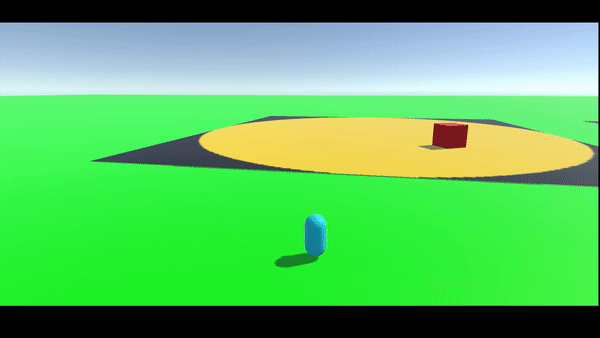

# RPG Helper
-----
RPG를 만들 때 필요한 기능들을 구현해놓은 프로젝트

## Monster
-----
몬스터의 이동 방법을 구현해 놓은 씬
### 몬스터 종류
+ 범위내 몬스터: 스폰 지역 내에서 이동하거나 멈춰있는 몬스터

+ 범위내 추적 몬스터: 스폰 지역 내에 플레이어를 추적하는 몬스터

+ 추적 몬스터: 자신의 추적 범위 내에 플레이어를 추적하는 몬스터

## NPC
-----
NPC와 대화하는 대화창을 구현해 놓은 씬
### 대화 범위
대화를 하기 위해서는 범위 내에 있어야함 NPC에게 두개의 collider를 넣어 isTrigger를 false로 지정하였음 
대화중에 움직임은 불가능하며 카메라의 대상이 해당 NPC로 변경

## Skill
-----
직업 별로 스킬을 다르게 구현할 수 있게 만들어 놓은 씬
### SceneMng.cs
SceneMng_Skill이 들어가 있는 오브젝트에서 직업을 선택하면 해당 직업에 맞는 캐릭터 생성 
마우스 좌클릭으로 기본공격과 1,2,3,4,5 키를 눌러 스킬 사용 가능 (현재 로그만 출력)

## Level
-----
캐릭터의 레벨 시스템을 구현해 놓은 씬
### LevelMng.cs
LevelData.json에 레벨과 레벨업에 필요한 경험치를 저장하여 읽어옴 
현재 1~10레벨 까지 있으며 수정 가능 
씬에 존재하는 버튼은 1레벨 업 기능과, 1,5,10의 경험치를 주는 버튼으로 구성

## Inventory
-----
인벤토리 시스템을 구현해 놓은 씬
### itemData.json
해당 프로젝트에서는 DB대신 Json을 이용하였으며 아이템을 획득 시 Inventory.ItemDatas 객체에 저장 
Inventory.ItemDats의 구성
+ List<ItemsData> equipItem: 장착 아이템을 저장하는 리스트, 획득하는 아이템이 이미 있어도 새로운 메모리를 할당받음
+ List<ItemsData> consumItem: 소비 아이템을 저장하는 리스트, 획득하는 아이템이 이미 있을시 해당 아이템의 count 증가
+ List<ItemsDAta> etcItem: 기타 아이템을 저장하는 리스트, 획득하는 아이템이 이미 있을시 해당 아이템의 count 증가 
### Inventory.cs
+ 구현된 아이템 종류는 장착(EQUIP), 소비(CONSUM), 기타(ETC)아이템이 있으며 Inventory.cs에 enum으로 지정되어있음
+ 아이템의 내용은 이름, 설명, 갯수, 링크로 구성되어있으며, 링크는 아이템의 이미지를 불러오는데 사용
+ 아이템을 획득하기 위한 데이터는 ScriptableObject를 사용하여 관리
+ 인벤토리에 등록되어있는 아이템의 정보가 들어갈 슬롯을 생성하여 재활용하는 Object Pooling기법 채용 (현재 100개의 슬롯을 풀링 중)
### Slot.cs
인벤토리 내 아이템 슬롯 버튼의 기능이 탑재된 스크립트
+ 슬롯에 지정된 아이템의 이미지 로딩 기능
+ 아이템 정보 표시 툴팁을 출력해주는 호버 기능
+ 슬롯을 클릭했을때 발생하는 함수 구현

## Demo
-----
현재 구현해놓은 기능들을 합쳐 놓은 씬

   
### 추가 설치 패키지
-----
Cinemachine, TextMeshPro